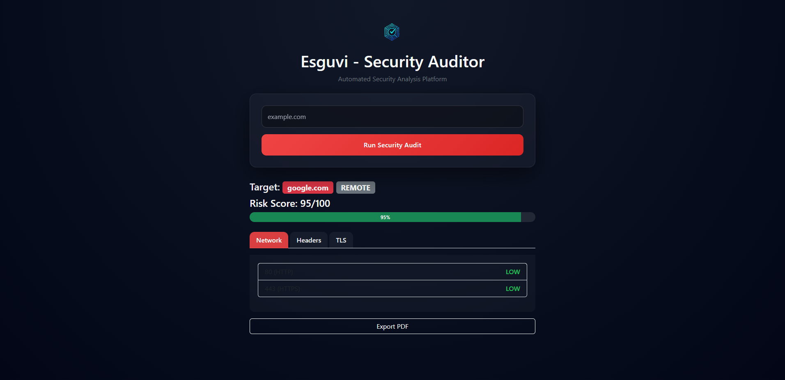

# Security Auditor - Web & PDF Security Reports



**Security Auditor** es una aplicación web desarrollada en **Flask** que permite analizar la seguridad de un objetivo (local o remoto) y generar reportes en PDF con la información más relevante: puertos abiertos, cabeceras de seguridad y configuración TLS.

## Características 🌟

- **Auditoría Local y Remota**: Realiza análisis de seguridad de sistemas locales y remotos.
- **Reporte PDF Profesional**: Genera un informe PDF con tabla de puertos, cabeceras de seguridad y TLS.
- **Interfaz Web Intuitiva**: Dashboard para ejecutar auditorías y ver resultados de manera clara.
- **Resumen Ejecutivo**: Incluye un apartado de resumen para entender rápidamente el estado de seguridad del objetivo.
- **Créditos**: Informe generado y diseñado por ESGUVI.

## Tecnologías Utilizadas ⚙️

- **Python 3**
- **Flask** - Framework web
- **ReportLab** - Generación de PDFs
- **HTML / Jinja2** - Plantillas para el dashboard
- **Bootstrap** (opcional) - Estilo y responsividad de la interfaz

## Estructura del Proyecto 🌇

- `app.py` - Archivo principal de Flask
- `config.py` - Configuración de la aplicación (nombre, opciones locales, etc.)
- `services/` - Lógica para auditorías locales (`local_audit.py`) y remotas (`remote_audit.py`)
- `templates/` - Plantillas HTML (`dashboard.html`)
- `static/` - Recursos estáticos (CSS, imágenes, JS)

## Instalación y Ejecución 🛠️

1. **Clona el repositorio**:
```bash
git clone https://github.com/Esguvi/security-auditor.git
```

2. **Crea y activa un entorno virtual**:
```bash
python -m venv venv
# Windows
venv\Scripts\activate
# macOS / Linux
source venv/bin/activate
```

3. **Instala dependencias**:
```bash
pip install -r requirements.txt
```

4. **(OPCIONAL) Define la variable de entorno para la clave secreta** (recomendado para producción):
```bash
# Windows
set FLASK_SECRET_KEY=mi_clave_super_secreta
# macOS / Linux
export FLASK_SECRET_KEY=mi_clave_super_secreta
```

5. **Ejecuta la aplicación**:
```bash
python app.py
```

6. Abre tu navegador y accede a `http://127.0.0.1:5000`

## Cómo usar 🖥️

1. Ingresa el objetivo que deseas auditar en el formulario principal.
2. Haz clic en **Run Audit**.
3. Visualiza el resultado en el dashboard.
4. Haz clic en **Export PDF** para generar un informe descargable.

## Contribuciones 💡

Las contribuciones son bienvenidas para mejorar y expandir la herramienta. Puedes:

1. Hacer un fork del repositorio.
2. Crear una nueva rama para tu feature:
```bash
git checkout -b feature/nueva-funcionalidad
```
3. Realizar los cambios y hacer commit:
```bash
git commit -am 'Agregué nueva funcionalidad'
```
4. Hacer push y abrir un Pull Request.

## Licencia 📜

Este proyecto está bajo la licencia **MIT**. Consulta el archivo [LICENSE](LICENSE) para más información.

## Contacto 📨

- **Email**: esguvioficial@gmail.com
- **GitHub**: [https://github.com/Esguvi](https://github.com/Esguvi)
- **Portfolio**: [https://esguvi-dev.vercel.app](https://esguvi-dev.vercel.app)
- **LinkedIn**: [Víctor Escaso Gutiérrez](https://www.linkedin.com/in/victor-escaso-gutierrez/)

**Desarrollado por**: *Esguvi* 🚀

